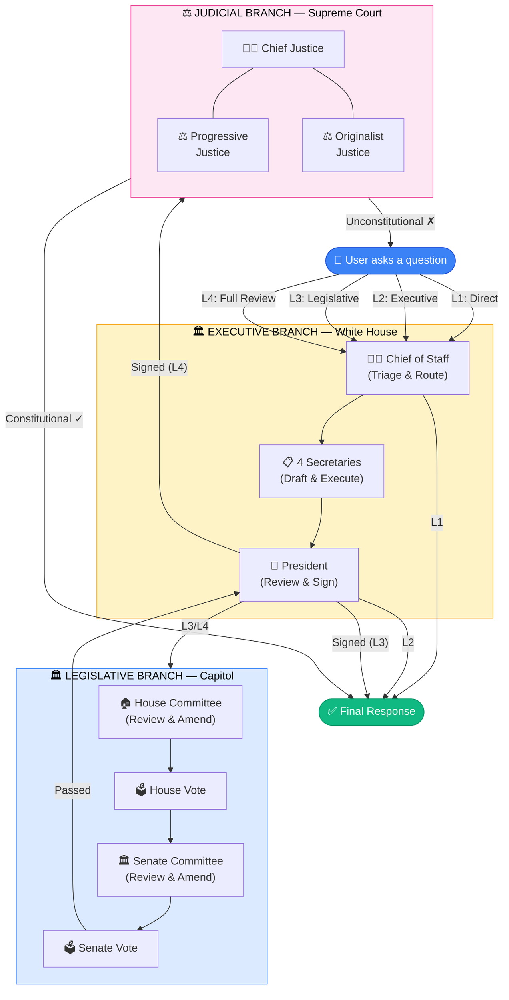

<p align="center">
  
  
  
  
  
  
</p>

<h1 align="center">🏛️ FedAgent</h1>
<h3 align="center">Separation-of-Powers Multi-Agent Collaboration System</h3>

<p align="center">
  <strong>A multi-AI-agent collaboration framework modeled after the U.S. federal government's separation of powers</strong>
</p>

<p align="center">
  <a href="#-features">Features</a> •
  <a href="#-architecture">Architecture</a> •
  <a href="#-quick-start">Quick Start</a> •
  <a href="#-task-levels">Task Levels</a> •
  <a href="#-constitution">Constitution</a> •
  <a href="./README_CN.md">📖 中文文档</a>
</p>

---

## 🌟 Introduction

**FedAgent** maps the U.S. federal government's separation of powers onto an AI agent collaboration architecture. 16 AI agents are distributed across the Executive, Legislative, and Judicial branches, collaborating through checks-and-balances mechanisms to ensure output quality, safety, and transparency.

> Every question you ask goes through a complete legislative process — drafting, deliberation, voting, signing (and even constitutional review).

### How It Works



#### Task Level Quick Reference

```
 ⚡ L1  User ──→ Chief of Staff ──────────────────────────────→ Response     (~5s)
 🔵 L2  User ──→ Chief of Staff ──→ Cabinet ──→ President ───→ Response    (~15s)
 🟣 L3  User ──→ CoS ──→ Cabinet ──→ House ──→ Senate ──→ President ──→ Response  (~45s)
 🔴 L4  User ──→ CoS ──→ Cabinet ──→ House ──→ Senate ──→ President ──→ Supreme Court ──→ Response  (~60s)
```

---

## ✨ Features

### 🏗️ Separation of Powers Architecture

| Branch | Building | Agents | Role |
|:------:|:--------:|:------:|:-----|
| 🏛️ **Executive** | White House | 7 | President, Chief of Staff, 4 Secretaries, Attorney General — Drafting & execution |
| 🏛️ **Legislative** | Capitol | 5 | Speaker, Senate Leader, Committees, CBO — Deliberation & voting |
| ⚖️ **Judicial** | Supreme Court | 3 | Chief Justice, Progressive & Originalist Justices — Constitutional review |
| 📢 **Press** | Press Room | 1 | Press Secretary — Result publication |

### 🎮 Pixel World Real-Time Visualization

- Procedural pixel art rendering powered by **PixiJS 8** (pure code, no sprite sheets)
- Real-time agent thinking, voting, and document transfer animations
- Mouse wheel zoom (0.5x–3x) and drag-to-pan
- High-DPI display support

### 💬 Multi-Turn Conversations

- Full conversation management (create, switch, delete)
- Streaming real-time responses
- Markdown-formatted rendering (headings, bold, code blocks, lists, tables)
- Per-message expandable processing details (flow trace, vote records)

### 🌐 Bilingual UI (Chinese / English)

- One-click language toggle
- All UI text, agent names, and status labels fully translated

### 🔒 Constitutional Constraint System

- Five amendments: User Sovereignty, Security Baseline, Quality Assurance, Transparency, Efficiency
- Judicial branch can review task outputs for constitutionality
- Users can add custom amendments via `/amend` command

---

## 🏗️ Architecture

```
┌─────────────────────────────────────────────────────────────┐
│                     Frontend (React + PixiJS)               │
│  ┌──────────┐  ┌───────────────────────┐  ┌──────────────┐ │
│  │ Sidebar   │  │ Pixel World + Chat    │  │ Agent Monitor│ │
│  └──────────┘  └───────────────────────┘  └──────────────┘ │
│                         │ WebSocket                         │
├─────────────────────────┼───────────────────────────────────┤
│                     Backend (FastAPI)                        │
│  ┌─────────────┐  ┌─────────────┐  ┌──────────────────┐   │
│  │ REST API    │  │ Event Bus   │  │ Orchestrator     │   │
│  └─────────────┘  └─────────────┘  └──────────────────┘   │
│                                           │                 │
│  ┌────────────────────────────────────────┼───────────┐    │
│  │              16 AI Agents              │           │    │
│  │  ┌──────────┐  ┌──────────┐  ┌────────┴─────┐    │    │
│  │  │Executive │  │Legislative│  │  Judicial    │    │    │
│  │  │ 7 agents │  │ 5 agents │  │  3 agents    │    │    │
│  │  └──────────┘  └──────────┘  └──────────────┘    │    │
│  └───────────────────────────────────────────────────┘    │
│                         │ LLM API                          │
│                    ┌────┴────┐                              │
│                    │ OpenAI  │                              │
│                    │ GPT-4o  │                              │
│                    └─────────┘                              │
└─────────────────────────────────────────────────────────────┘
```

### State Machine Flow

```
intake → drafting → house_review → senate_review → president_review
    │                                                      │
    │   ┌─── vetoed ← ─── ─── ─── ─── ─── ─── ─── ─── ───┘
    │   │        │
    │   │   override_vote
    │   │        │
    │   └────────┴──→ executing → judicial_review → enacted
    │                                    │
    └──→ L1/L2 fast track ──→ completed  └──→ unconstitutional / tabled
```

---

## 🚀 Quick Start

### Prerequisites

- Python 3.11+
- Node.js 18+
- OpenAI API Key (GPT-4o)

### 1. Clone

```bash
git clone https://github.com/xding2/fedagent.git
cd fedagent
```

### 2. Configure

```bash
# Create .env file for your API key (never committed to git)
echo "OPENAI_API_KEY=sk-your-key-here" > .env

# Copy example config
cp config.yaml.example config.yaml
```

### 3. Install & Run

**One-click start:**

```bash
# Windows
start.bat

# Linux / macOS
./start.sh
```

**Manual start:**

```bash
# Backend
pip install -r requirements.txt
cd backend
uvicorn app.main:app --reload --port 8000

# Frontend (new terminal)
cd frontend
npm install
npm run dev
```

### 4. Access

Open browser at: **http://localhost:5173**

---

## 📊 Task Levels

FedAgent provides four processing levels based on task complexity:

| Level | Name | Process | Time | Use Case |
|:-----:|:----:|:--------|:----:|:---------|
| ⚡ **L1** | Quick Reply | Chief of Staff answers directly | ~5s | Simple Q&A, casual chat |
| 🔵 **L2** | Executive | President approval → Secretary execution | ~15s | Regular tasks, code generation |
| 🟣 **L3** | Legislative | Drafting → Both chambers vote → President signs | ~45s | Complex decisions, system design |
| 🔴 **L4** | Full Review | L3 + Supreme Court constitutional review | ~60s | High-risk operations, security audits |

Select a level manually from the input bar, or choose **Auto** to let AI decide.

---

## ⚖️ Constitution

Five built-in amendments serve as the supreme guidelines for all agent behavior:

1. **User Sovereignty** — User instructions take precedence over system processes
2. **Security Baseline** — Must not introduce known security vulnerabilities
3. **Quality Assurance** — Output must be relevant and useful
4. **Transparency** — All decision processes must be traceable
5. **Efficiency** — Simple tasks must not be over-processed

See [`CONSTITUTION.md`](./CONSTITUTION.md) for details.

---

## 🛠️ Tech Stack

| Layer | Technology |
|:-----:|:-----------|
| Frontend | React 18, TypeScript 5, Vite 6, TailwindCSS 3, PixiJS 8, Zustand 5 |
| Backend | Python 3.11, FastAPI, SQLAlchemy (async SQLite), WebSocket |
| AI Models | OpenAI GPT-4o (core agents), GPT-4o-mini (supporting agents) |
| Visualization | PixiJS Procedural Pixel Art |
| State | Zustand (frontend), Finite State Machine (backend orchestrator) |

---

## 📁 Project Structure

```
fedagent/
├── backend/
│   ├── app/
│   │   ├── api/              # REST API routes
│   │   │   ├── conversations.py  # Conversation CRUD + messages
│   │   │   └── tasks.py         # Task submission/control
│   │   ├── models/           # SQLAlchemy models
│   │   ├── services/         # Service layer (event bus)
│   │   ├── workers/          # Orchestrator (state machine)
│   │   ├── database.py       # Database config
│   │   └── main.py           # FastAPI entry point
│   └── ...
├── frontend/
│   ├── src/
│   │   ├── components/       # React components
│   │   ├── engine/           # PixiJS rendering engine
│   │   ├── stores/           # Zustand state management
│   │   ├── hooks/            # Custom hooks
│   │   └── i18n.ts           # Internationalization
│   └── ...
├── agents/                   # Agent prompt definitions
├── CONSTITUTION.md           # System constitution
├── config.yaml.example       # Config template
└── docker-compose.yml        # Docker deployment
```

---

## 🐳 Docker

```bash
docker-compose up -d
```

Visit: **http://localhost:8000**

---

## 📄 License

MIT

---

<p align="center">
  <strong>🏛️ FedAgent</strong> — <em>AI with Checks and Balances</em>
</p>
